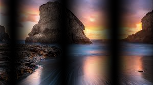
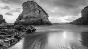

# Image downsampling experiments

write intro

# Results

## Original test image

## Gaussian Pyramid Downsampling - single-layered pyramid

## Manual Downsampling - raw 

## Manual Downsampling - just columns 

## Manual Downsampling - just rows

## Manual Downsampling - rows and columns
This is quantitatively equivalent to Gaussian Pyramid

